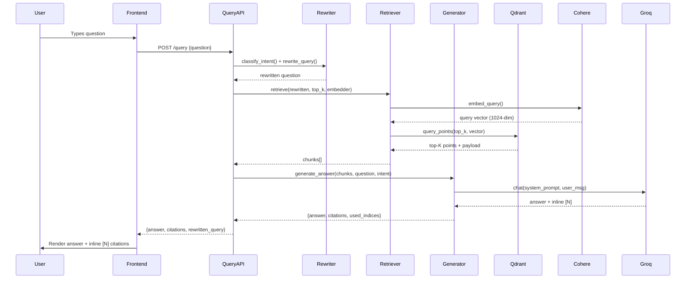
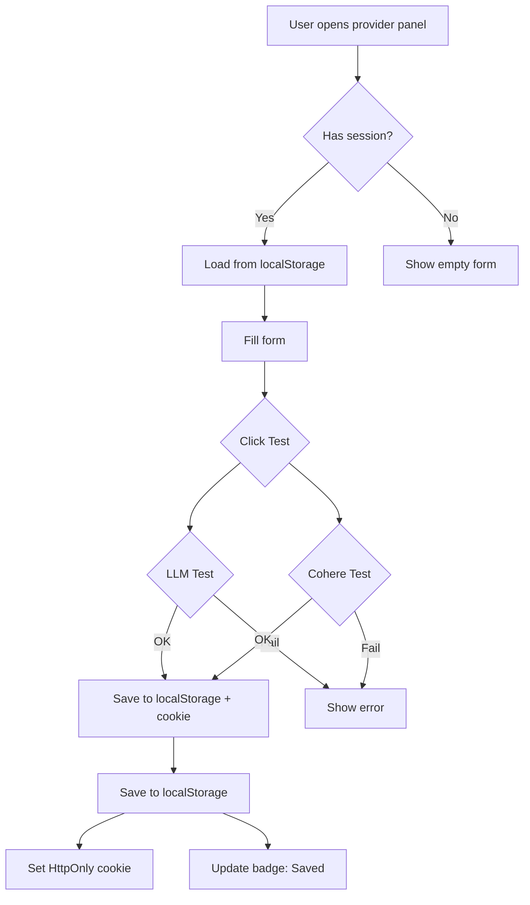
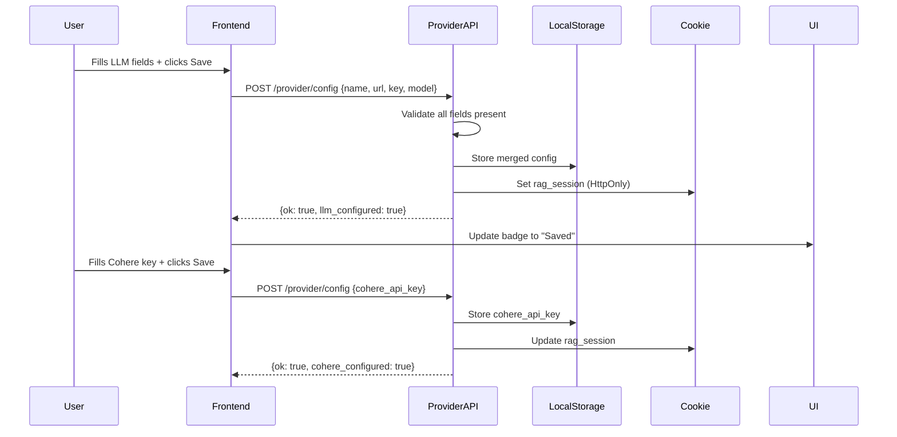
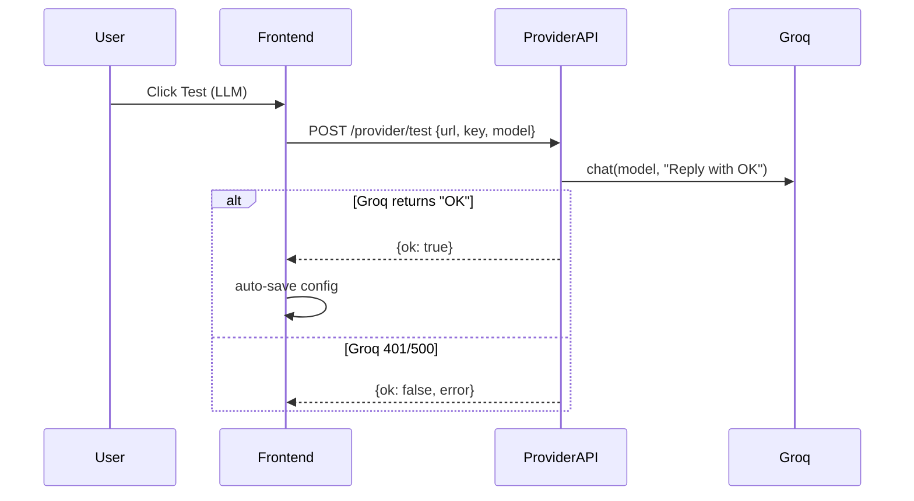
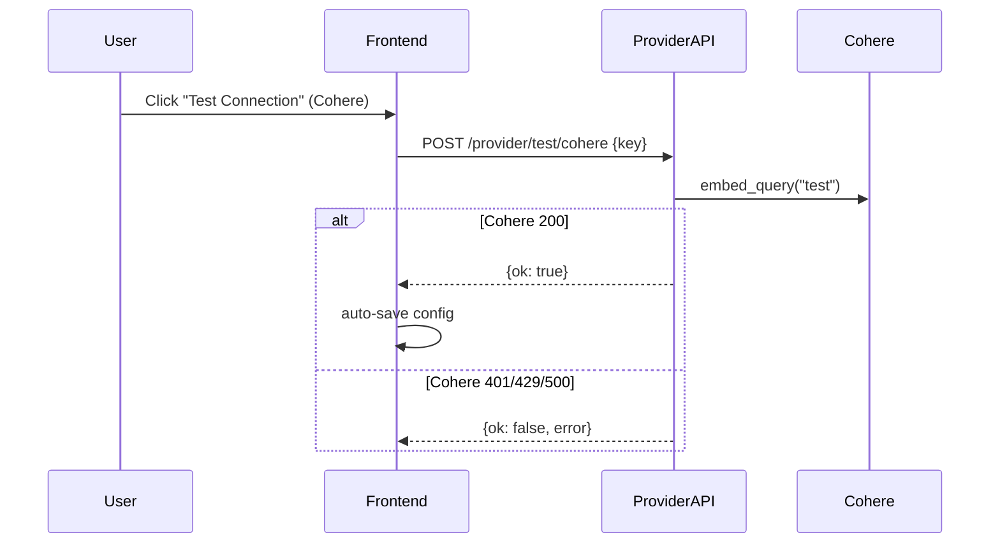
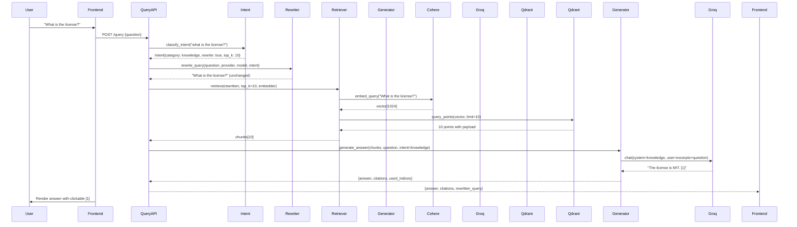
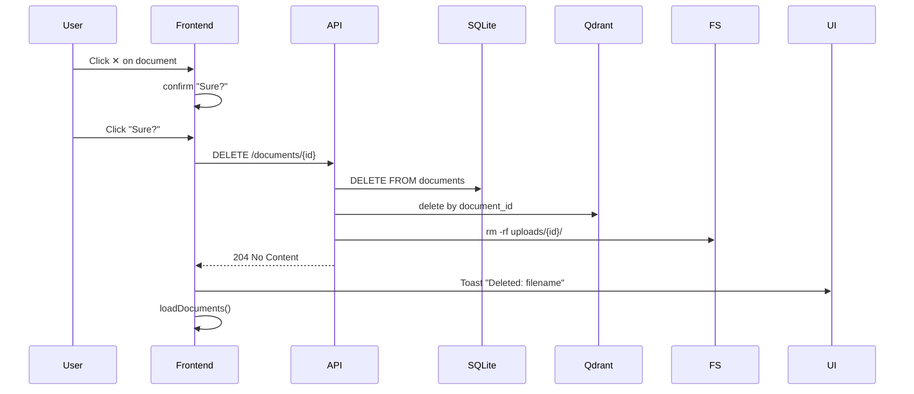
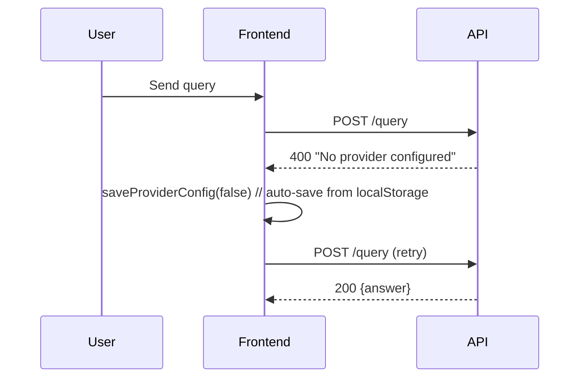
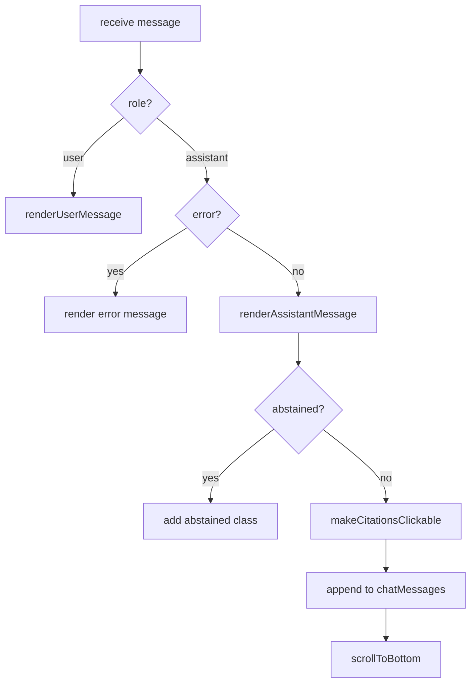

# Data Flows

## Document Ingestion Flow

```mermaid
flowchart TD
    A[User selects file] --> B[POST /documents/upload]
    B --> C[Stream to disk in 1MB chunks]
    C --> D[Create document record: UPLOADED]
    D --> E[Return 202 Accepted + doc_id]
    E --> F[Background task starts]
    F --> G[parse_file() by extension]
    G --> H[chunk_text() per page]
    H --> I{chunks > MAX?}
    I -- Yes --> J[FAILED: too many chunks]
    I -- No --> K[embed_chunks() via Cohere]
    K --> L[create_collection if needed]
    L --> M[upsert_chunks to Qdrant]
    M --> N[update status: READY]
    N --> O[polling detects READY]
    O --> P[UI shows green badge]
```

### Step Details

| Step | Operation | Duration |
|------|-----------|----------|
| Upload | Stream to disk (1MB chunks) | <1s per MB |
| Parse | `fitz` (PDF), `docx`, `markdown`, `text` | <500ms |
| Chunk | ~800 chars, 100 overlap | <10ms |
| Embed | Cohere API (batch 96) | ~1-2s per 100 chunks |
| Index | Qdrant upsert | <200ms |

### Failure Points

| Stage | Error | Recovery |
|-------|-------|----------|
| Parse | Empty text (scanned PDF) | `ParsingError` → FAILED |
| Chunk | >2000 chunks | FAILED, user splits file |
| Embed | Cohere 401/429 | Retry on 429; 401 = invalid key |
| Upsert | Qdrant 400/500 | Logged, status FAILED |

---

## Query Flow



### Intent Classification → Retrieval Params

| Intent | Rewrite? | Top-K | Temp | Max Context |
|--------|----------|-------|------|-------------|
| verbatim | No | 15 | 0.0 | 6 |
| teach | No | 10 | 0.2 | 6 |
| summarize | No | 12 | 0.1 | 6 |
| compare | No | 10 | 0.1 | 6 |
| knowledge | If vague | 10 | 0.1 | 6 |

### Query Rewriter Rules

- Skip rewrite for specific questions (≥5 words + question word)
- Rewrite vague/short: "hi" → "What is this document about?"
- Fix typos: "thsis" → "this"
- Preserve intent: "write this docs as is" stays verbatim

---

## Provider Configuration Flow



### Session Cookie

- Name: `rag_session`
- HttpOnly, SameSite=Lax
- Value: random hex (maps to `data/sessions.json`)
- Persists across browser sessions

---

## Chat Persistence Flow

```mermaid
flowchart TD
    A[New message sent] --> B[Add user message to state.messages]
    B --> C[persistCurrentChat()]
    C --> D[saveMessagesForChat(chat_id)]
    C --> E[update chat metadata]
    E --> F[saveChats()]
    F --> G[renderMessages()]

    H[User clicks chat in sidebar] --> I[switchToChat(chatId)]
    I --> J[state.messages = loadMessagesForChat(id)]
    J --> K[renderMessages()]
    K --> L[renderChatList() highlights active]

    M[Click + New Chat] --> N[createNewChat()]
    N --> O[generate id, save empty messages]
    O --> P[add to chats list]
    P --> Q[switchToChat(new_id)]

    R[Click delete on chat] --> S{Confirm?}
    S -- Yes --> T[deleteChat()]
    T --> U[remove from localStorage]
    T --> V{if active, switch to first}
```

### localStorage Keys

| Key | Value |
|-----|-------|
| `rag.chats.v1` | `Chat[]` — `{id, title, created, updated}` |
| `rag.active_chat.v1` | `string` — current `chat_id` |
| `rag.messages.{chat_id}` | `Message[]` — per-chat history |
| `rag_config` | `{name, base_url, api_key, model}` |
| `rag_cohere_key` | `string` |

---

## Error Handling Flow

```mermaid
flowchart TD
    A[Error occurs] --> B{Where?}
    B -- Upload --> C[ValidationError → 400]
    B -- Ingestion (bg) --> D[catch → logger.exception → status=FAILED]
    B -- Query (retrieve) --> E{Empty chunks?}
    E -- Yes --> F[return "no documents" abstained]
    E -- No --> G[generate_answer()]
    G --> H{LLM error}
    H -- Timeout --> I[ProviderError: timeout]
    H -- 401/500 --> J[ProviderError: upstream]
    H -- Success --> K[return answer]
    B -- Provider config --> K{Validation}
    K -- Missing fields --> L[ValidationError 400]
    K -- Upstream 401 --> M[ValidationError: invalid key]
```

### User-Facing Errors

| Scenario | Message |
|----------|---------|
| No LLM config | "Configure LLM provider first" |
| No Cohere key | "Configure Cohere API key first" |
| Scanned PDF | "PDF has N pages but no extractable text. Install Tesseract OCR." |
| Too many chunks | "Document produces N chunks, exceeds limit of 2000" |
| LLM timeout | "LLM request timed out after 45 seconds" |
| Cohere 401 | "Invalid Cohere API key" |
| Groq 401 | "Invalid API key" |

---

## Provider Configuration Flow (Detailed)



### Test Connection Flow



### Cohere Test



---

## Document Ingestion Detailed Steps

```mermaid
flowchart TD
    A[File selected] --> B[Validate size < 2GB]
    B --> C[Create upload dir: uploads/{doc_id}/]
    C --> D[Stream write in 1MB chunks]
    D --> E[Create doc record: UPLOADED]
    E --> F[Return 202 + doc_id]
    F --> G[Background task (semaphore)]
    G --> H[parse_file()]
    H --> I{pages > 0?}
    I -- No --> J[FAILED: no text]
    I -- Yes --> K[chunk_text per page]
    K --> L{chunks > 2000?}
    L -- Yes --> M[FAILED: too many]
    L -- No --> N[embed_chunks batch 64]
    N --> O[create_collection dim=1024]
    O --> P[upsert_chunks]
    P --> Q[status=READY]
```

### Logging Events (Structured)

| Event | Fields |
|---------|--------|
| `parse_started` | `document_id` |
| `parse_done` | `document_id, pages, duration_ms` |
| `chunk_done` | `document_id, chunk_count, duration_ms` |
| `embed_started` | `document_id, chunk_count` |
| `embed_progress` | `document_id, done, total` |
| `embed_done` | `document_id, duration_ms` |
| `upsert_start` | `collection, doc_id, point_count` |
| `upsert_done` | `collection, doc_id, status` |
| `index_done` | `document_id, duration_ms` |
| `ingestion_failed` | `document_id, error` |

---

## Query Path (End-to-End)



### Key Decision Points

| Decision | Logic |
|----------|-------|
| Rewrite query? | Only if `intent.rewrite_needed` (vague/short) |
| Top-K | From `intent.max_chunks` (6-15) |
| Temperature | From `intent.temperature` (0.0-0.2) |
| System prompt | `PROMPTS[intent.category]` |
| Max context chunks | `settings.max_context_chunks` (6) |
| Verbatim mode | No citations, raw text output |

---

## Provider Config Persistence

```mermaid
flowchart TD
    A[Page load] --> B[loadSavedConfig()]
    B --> C{localStorage.rag_config?}
    C -- Yes --> D[Fill form, set badge Saved]
    C -- No --> E[Show empty, badge Not saved]
    D --> F[localStorage.rag_cohere_key?]
    F -- Yes --> G[Fill Cohere key, badge Saved]
    F -- No --> H[Empty Cohere, badge Not saved]
```

### Storage Keys

| Key | Storage | Scope |
|------|---------|-------|
| `rag_config` | localStorage | LLM config (persists tab close) |
| `rag_cohere_key` | localStorage | Cohere key (persists tab close) |
| `rag_session` | HttpOnly cookie | Server session (auto-sent) |
| `ui.leftCollapsed` | sessionStorage | Left panel state |
| `ui.rightCollapsed` | sessionStorage | Right panel state |

---

## Document Deletion Flow



### Cleanup Order

1. Qdrant delete (by `document_id` payload filter)
2. SQLite delete
3. Upload directory removal (best effort)
4. All in `try/except` — failures logged, 204 returned

---

## Health & Monitoring

```mermaid
flowchart TD
    A[Startup] --> B[lifespan: init_db, mark_stale]
    B --> C[/health endpoint]
    C --> D{Every 30s}
    D -- Yes --> E[curl /health]
    E --> F{200 OK?}
    F -- No --> G[Alert/Log]
    D -- No --> C
```

### Health Check

- `GET /api/v1/health` → `{"status": "ok"}`
- Checks: DB connection, Qdrant reachable (implicit via queries)
- No external API calls in health check

---

## Provider Test Flow


### Cohere Test


---

## Polling & WebSocket (Future)

Currently: **HTTP polling** every 2s for document status (max 100 attempts = 3.3 min)

Future: WebSocket for real-time status updates

```mermaid
sequenceDiagram
    Frontend->>API: POST /documents/upload
    API-->>Frontend: 202 {doc_id}
    Frontend->>Frontend: setInterval(poll, 2000)
    loop Poll
        Frontend->>API: GET /documents/{id}
        API-->>Frontend: {status, chunk_count}
        alt READY
            Frontend->>Frontend: clearInterval, toast success
        else FAILED
            Frontend->>Frontend: clearInterval, show error
    end
```

---

## Error Recovery Flows

### Stale Session Auto-Recovery



### Document Processing Failure

```mermaid
flowchart TD
    A[Background ingestion] --> B{Exception?}
    B -- Yes --> C[logger.exception]
    C --> D[update status=FAILED]
    D --> E[error_message = str(e)]
    E --> F[re-raise]
    F --> G[run_ingestion catches]
    G --> H[update status=FAILED]
    H --> I[log exception]
```

---

## Concurrency Control

```mermaid
flowchart TD
    A[New ingestion task] --> B[_ingest_semaphore.acquire()]
    B --> C{Acquired?}
    C -- Yes --> D[Run _ingest_pipeline]
    D --> E[Release semaphore]
    C -- No --> F[Wait]
    F --> B
```

- Only one document processes at a time (`threading.Semaphore(1)`)
- Prevents Cohere rate limit (429) and Qdrant overload
- Document deleted during processing → early exit

---

## Frontend Rendering Pipeline



### makeCitationsClickable Flow

```mermaid
flowchart TD
    A[makeCitationsClickable(el, citations)] --> B{el && citations?}
    B -- No --> End
    B -- Yes --> C[extract innerHTML]
    C --> D[pattern: /\[(\d+)\]/g]
    D --> E[find all [N] matches]
    E --> F[for each match: wrap in <span class=inline-cite>]
    E --> G[el.innerHTML = new HTML]
    G --> H[add click listeners to .inline-cite]
    H --> I[click → open modal with citation quote]
```

---

## CSS Layout Flow

```mermaid
flowchart TD
    A[.layout: grid 280px minmax(0,1fr) 320px] --> B[.chat-main: flex column]
    B --> C[.header: flex:0 0 auto]
    B --> D[.chat-messages: flex:1 1 auto, min-height:0, overflow-y:auto]
    B --> E[.input-area: flex:0 0 auto]
    D --> F[scrollable messages only]
    C --> G[fixed top]
    E --> H[fixed bottom]
```

### Collapse States

| Class | Grid Columns |
|-------|--------------|
| Default | `280px minmax(0,1fr) 320px` |
| Left collapsed | `0 minmax(0,1fr) 320px` |
| Right collapsed | `280px minmax(0,1fr) 0` |
| Both | `0 minmax(0,1fr) 0` |

`minmax(0, 1fr)` allows center column to shrink below content width without forcing overflow.